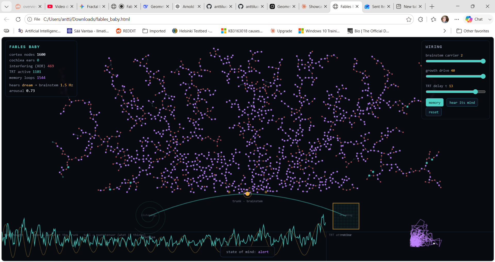

# **Fables Baby**

Live at: https://anttiluode.github.io/FablesBaby/

**A small brain, wired to think.**  
Fables Baby is a unified, single-file biological computing experiment. It simulates a living, growing neural fractal that processes audio and visual stimuli through dendritic delay lines and wave interference, rather than traditional matrix multiplication.  
There is no training, no pre-calculated weights, and no hidden layers. Everything is grown, and everything is visible.

## **🧠 How It Works**

* **The Senses (Cochlea & Retina):** The system uses your microphone and webcam. The cochlea acts as a bank of Stuart-Landau resonators, dynamically growing "ears" to listen to new frequencies based on auditory surprise. The retina senses light and motion.  
* **The Trunk (Brainstem):** The world does not flood the network. Audio and visual inputs fuse at a single root node (the trunk). What the brain hears sets the rhythm of its internal brainstem carrier wave.  
* **Fractal Propagation:** The sensory-modulated carrier wave propagates outward through a dynamically growing fractal tree. Each dendritic branch introduces a specific temporal delay.  
* **Interference & Memory (XOR):** Signals reach the tips and reflect back down. At every fork, the differently-delayed signals interfere. The network uses an XOR-like logic gate to compare them. Where the internal rhythm and the sensory echoes align, the network resonates, and **memory loops** latch into place using TRT (Temporal Response Time) invariants.

## **🚀 How to Run**

1. Download or save the fables\_baby.html file.  
2. Open the file in any modern web browser (Chrome, Edge, Firefox, Safari).  
3. Choose your waking state:  
   * **WAKE — mic \+ camera:** Full sensory input. (Requires browser permissions).  
   * **mic only:** Audio-driven processing.  
   * **let it dream:** No external inputs. The brain generates and processes its own internal procedural signals.

## **🎛️ HUD & Controls**

### **The Readout (Top Left)**

* **cortex nodes:** The current size of the growing fractal brain.  
* **cochlea ears:** Active auditory resonators.  
* **interfering (XOR):** Nodes currently experiencing destructive interference.  
* **TRT active / memory loops:** Nodes resonating and holding memory states.  
* **state of mind:** The arousal level of the system (asleep, drowsy, awake, alert), which drives the rate of dendritic growth.

### **The Wiring (Top Right)**

* **brainstem carrier:** Adjusts the amplitude of the internal base rhythm.  
* **growth drive:** Controls how aggressively the brain attempts to grow new dendrites when aroused.  
* **TRT delay τ:** Changes the temporal delay window used for extracting invariants and forming memory.  
* **memory / hear its mind:** Toggles the memory latching and routes the internal cochlear resonance to your speakers.

### **The Thought (Bottom Strip)**

* **Oscilloscope:** Visualizes the world input at the trunk (amber) versus the root tensor/what the brain is actually "thinking" (teal).  
* **TRT Attractor:** A phase-space plot showing the current thought state versus its past state across the delay $\\tau$.
